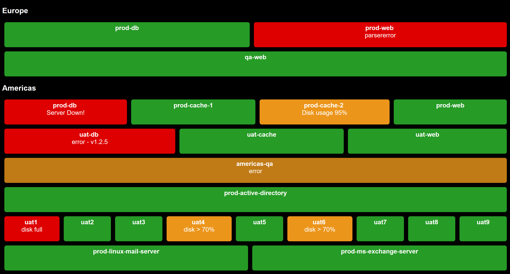
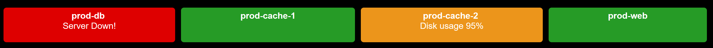

'Status' is a small HTML/JavaScript application that can visually monitor a set of URLs.



It was built for monitoring a set of microservices, but can be used to monitor anything which has an accessible URL.

Status polls the configured URLs periodically and renders status 'tiles' based on the results.

# Limitations
## Status cannot easily access URLs from different domains
Status uses AJAX to fetch the config file, and to poll URLs.  Due to restrictions put in place in modern browsers to prevent Cross Site Scripting (XSS) attacks, AJAX cannot easily interact with pages from different domains.  <a href="https://www.moesif.com/blog/technical/cors/Authoritative-Guide-to-CORS-Cross-Origin-Resource-Sharing-for-REST-APIs/">See here</a> for more info.  If you wish to access pages on a different domain, then you will need to configure the "Access-Control-Allow-Origin" policy on the web server that you are 'checking'.  See the documentation for your specific web server on how to configure.

## Browser support
Status uses EcmaScript6.  See <a href="https://www.w3schools.com/js/js_es6.asp">here</a> for a list of compatible browsers.  Anything after 2016 should be fine.  (With the exception of IE).

# Installation
* Download the latest distribution from <a href="https://github.com/benjwarner/status/tree/master/dist">here</a>.  
* Unzip it to a folder which is served by a web server.  (It is not enough to just unzip to a directory and open into a web browser as Status uses ajax to fetch the config file and to poll URLs, and AJAX won't work if the status html and JavaScript is not served from a web server.)
* Edit the config, and enter URLs that you wish to check.
* View status.html on your web server.

# Configuration guide
## Simple configuration
By default, Status will simply check the given URL(s), and will report back as OK if the URL can be successfully fetched.

The Status html should include (a sample is provided with the download):
* A link to the provided status.css file.
* A link to the provided jquery js file.
* A link to the provided app.js file.
* A html element to hold the content.
* A call to the Sample constructor.

Sample HTML:
```html
<html>
    <head>
        <link rel="stylesheet" type="text/css" href="status.css"/>
    </head>
    <body>
        <div id="content"></div>
    </body>
    <script type="text/javascript" src="jquery-3.3.1.js"></script>
    <script type="text/javascript" src="app.js"></script>
    <script>
        new Status("config.json", document.getElementById("content"))
    </script>
</html>
```
As per the above call to the Status constructor, you must pass in the path to a config json file, and the HTML element that will receive the content.

A simple configuration JSON file might look like this:
```json
{
  "checks": [
    {
      "name": "prod-db",
      "url": "my.domain.org/prod-db.html"
    }
  ]
}
```
The above configuration will poll the URL my.domain.org/prod-db-status.json every 5 seconds (the default), and will show a green status tile, if the page was available.

You can override how often pages are checked by specifying sleepBetweenChecksMs at the top level.  e.g.
```json
{
  "sleepBetweenChecksMs": "10000",
  "checks": [
    {
      "name": "prod-db",
      "url": "my.domain.org/prod-db.html"
    }
  ]
}
```
If you want to specify multiple checks, then define them in the 'checks' array.  e.g.
```json
{
  "sleepBetweenChecksMs": "10000",
  "checks": [
    {
      "name": "prod-db",
      "url": "my.domain.org/prod-db.html"
    },
    {
      "name": "prod-web",
      "url": "my.domain.org/prod-web.html"
    }
  ]
}
```
If you want to group checks, you can use a 'group' array.  e.g.
```json
{
  "sleepBetweenChecksMs": "10000",
  "group" : [
    {
      "heading" : "prod",
      "checks": [
        {
          "name": "prod-db",
          "url": "my.domain.org/prod-db.html"
        },
        {
          "name": "prod-web",
          "url": "my.domain.org/prod-web.html"
        }
      ]
   },{
     "heading" : "qa",
     "checks": [
        {
          "name": "qa-db",
          "url": "my.domain.org/qa-db.html"
        },
        {
          "name": "qa-web",
          "url": "my.domain.org/qa-web.html"
        }
      ]
   }
]
}
```
Groups can be nested to any depth.  See here for an example that defines nested groups.

## Parsing fetched URLs for status
The default behaviour of Status is to simply check if a URL returns status code 200.  However if your URL returns JSON, you can parse the returned JSON for information to show on the status tile, by setting parse = true on a check. e.g.
```json
{
  "checks": [
    {
      "name": "prod-db",
      "url": "my.domain.org/prod-db.json",
      "parse": true
    }
  ]
}
```
During parsing, Status will look for the following fields:

* **name** (will be displayed on the status tile)
* **link** (the status tile will be linked to this URL)
* **status** (Will be used to create a css style on the status tile.  If you wish to use existing style classes, then should return 'ok', 'warning' or 'error').
* **statusText** (Will be displayed as sub-text on the tile.)
* **statusToolTip** (Will set the tooltip on the status tile. If not given, this will default to the value of 'link'.)

Example JSON that could be parsed:
```json
{
  "name": "web-server-3",
  "link": "http://my.domain.com/admin",
  "status": "ok",
  "statusText": "Success"
}
```
You can also return multiple status entries in an array.  If you return an array of entries from json (note the root node must be an array, not an object), then Status will create a status tile for each element in the array.  e.g.
```json
[
  {
    "name": "prod-db",
    "statusText": "Server Down!",
    "status": "error",
    "link": "http://www.google.com"
  },
  {
    "name": "prod-cache-1",
    "statusText": "OK",
    "status": "ok",
    "link": "http://www.dropbox.com"
  },
  {
    "name": "prod-cache-2",
    "statusText": "Disk usage 95%",
    "status": "warning",
    "link": "http://www.hbo.com"
  },
  {
    "name": "prod-web",
    "statusText": "OK",
    "status": "ok",
    "link": "http://www.yahoo.com"
  }
]
```
will render:


If you wish to parse returned JSON which has different property names, then you will need to define a parse spec.  The default parseSpec is:
```json
{
    "name": {"propertyName": "name"},
    "link": {"propertyName": "link"},
    "status": {"propertyName": "status"},
    "statusText": {"propertyName": "statusText"},
    "statusToolTip": {"propertyName": "link"}
}
``` 
You can override the default parseSpec at the group or check level.  If defined at the group level, it will be applied to all parsing checks within that group and child groups (unless overridden again within a child group or child check).  
You can substitute any of these propertyName values to look for your own properties.  e.g.
```json
{
    "name": {"propertyName": "instance"},
    "link": {"propertyName": "url"},
    "status": {"propertyName": "statusCode"},
    "statusText": {"propertyName": "version"},
    "statusToolTip": {"propertyName": "url"}
}
```
...will extract out properties 'instance', 'url', 'statusCode' & 'version'.

If you wish to do anything more complex than fetch properties, e.g. if you wish to display the concatenation of two properties as status text.  Then you can specify an "asCode" method.

The 'asCode' method will run the subsequent text as JavaScript.  If you wish to reference the JSON block being parsed in an asCode term, it is available as 'jsonElement'.
```json
{
    "name": {"propertyName": "name"},
    "link": {"propertyName": "link"},
    "status": {"propertyName": "status"},
    "statusText": {"asCode": "jsonElement.status + ' - ' + jsonElement.version"},
    "statusToolTip": {"propertyName": "link"}
}
```
The above example will return a concatenation of the 'status' and 'version' properties of the JSON object.

NOTE: The 'asCode' method runs a JavaScript eval() statement.  The eval() statement runs whatever is passed to it in the local context.  Please ensure that the JSON your are parsing is from a trusted source, otherwise there is the potential for script injection.

## Displaying multiple Status instances on the same page
Just create two containers, and instantiate two Status objects.  e.g.
```html
<html>
    <head>
        <link rel="stylesheet" type="text/css" href="status.css"/>
    </head>
    <body>
        <div id="content1"></div>
        <div id="content2"></div>
    </body>
    <script type="text/javascript" src="jquery-3.3.1.js"></script>
    <script type="text/javascript" src="app.js"></script>
    <script>
        new Status("config1.json", document.getElementById("content1"))
        new Status("config2.json", document.getElementById("content2"))
    </script>
</html>
```
# Styling
The supplied status.css file should get you most of the way.  Feel free to tweak it any way you wish to get the style that you want.

Some tips:

The statusCode of simple URL responses, and the 'status' property of parsed responses is appended to 'status-' to create a css class for the tile.  e.g. if a page returns status code 404, then 'status-404' will be applied as a css class on that status tile.

If you wish to hide any of the group level headings, then set the display to 'none'.  e.g. to disable 2nd level group headings:
```css
h2 {
    display: none;
}
```
If you wish to see what classes are used on the generated status panel, then hit ctrl-shift-c on most browsers, and click on the element you are interested in.  Otherwise just hit F12 and browse the generated code.

By default status text is not displayed if status is ok (did not return an error.)  If you wish to _always_ display status text, then remove the css:
```css
a.status-ok status-text {
    display: none;
}
```